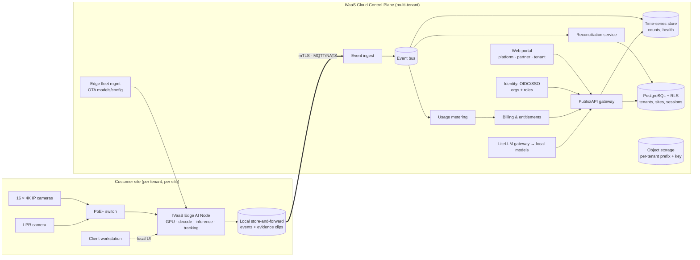
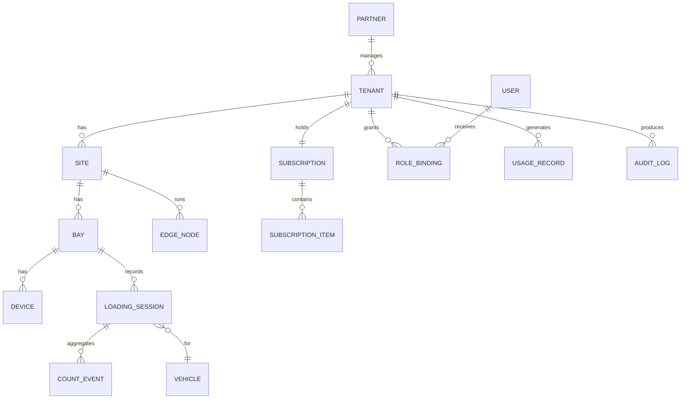
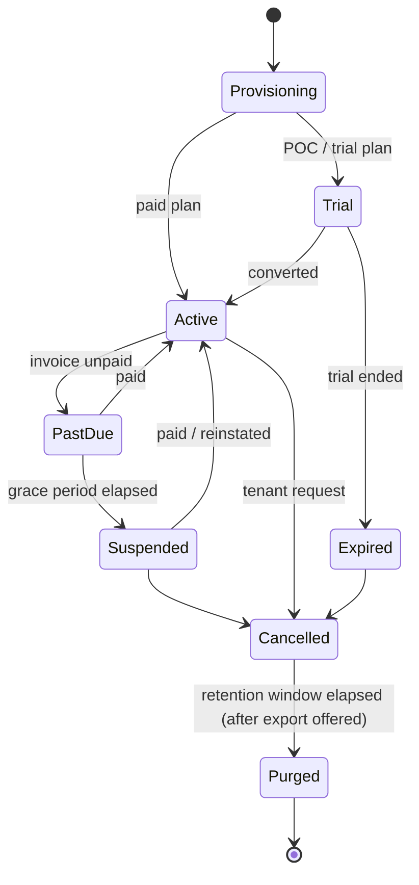
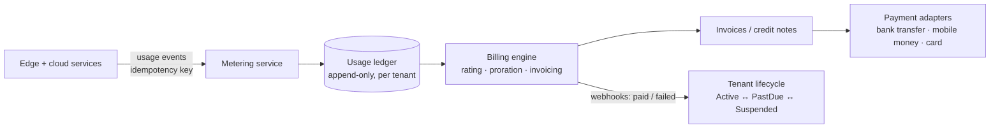
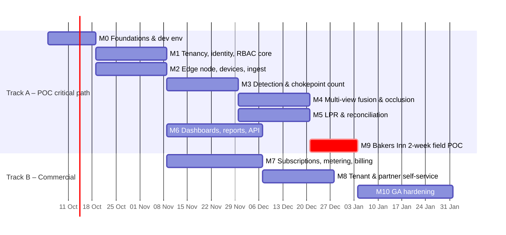

# Cassava IVaaS — Proposed Solution & Milestone Plan

**Commercial multi-tenant IVaaS platform, with the Bakers Inn stacked crate counting POC as the first tenant**

| | |
|---|---|
| Source inputs | *Bakers Inn POC Technical Scope v1.0* (Sep 2026) · *AI Engineering Guide: Running Local & Self-Hosted Models with OpenCode* |
| Platform owner | Cassava (IVaaS) |
| Solution partner | LITZIM |
| First tenant | Bakers Inn Industrial Complex |
| Status | Draft proposal for review |

---

## 1. Summary

The Bakers Inn POC needs one thing proven: **more than 95% crate count accuracy per truck at one loading bay over 2 weeks**. It uses 16 × 4K cameras, 1 LPR camera and 1 GPU edge node. IVaaS is also a commercial product, so the POC cannot be a one-off build. It has to run as **tenant #1 on the real platform** from the start. Adding tenancy, RBAC and metering to a single-customer build later means rewriting the data layer, auth and APIs.

The plan therefore runs in **two tracks**:

- **Track A: POC critical path (M0–M6 → M9).** Everything needed to count crates, read plates, reconcile, and show results. It is built tenant-aware from the start, but the commercial screens stay minimal.
- **Track B: Commercial platform (M7, M8, M10).** Subscriptions, entitlements, metering, billing, self-service tenant and partner management, and GA hardening. It runs in parallel and does not block the POC.

Each milestone has an **exit gate**: automated tests plus a demo that must pass before the milestone is closed.

The self-hosted LLM setup from the engineering guide (OpenCode → LiteLLM → Gemma / Qwen / Nemotron / GPT-OSS 120) is used in two places:
1. **Engineering workflow.** The team's coding assistant, so code stays on internal infrastructure (M0).
2. **Product feature.** An optional tenant-scoped "Ask IVaaS" assistant that summarises reconciliation exceptions and answers natural-language questions over a tenant's own data. Usage is metered and billed per tenant (M6/M7).

---

## 2. Target Architecture

### 2.1 Logical view



### 2.2 Key design decisions

| Decision | Choice | Rationale |
|---|---|---|
| Where inference runs | **On the edge node.** Only events, metadata and short evidence clips go to the cloud. | Pushing 16 × 4K streams to the cloud is not practical. Local inference also keeps counting running when the WAN drops, and keeps video on-site for data residency. **Confirmed for the POC:** all data stays in Zimbabwe, and cloud components run on Cassava in-country infrastructure. |
| Primary counting method | **Chokepoint stack counting**, cross-checked by volumetric bay views. The 2 chokepoint cameras count each dolly or stack as it crosses into the truck. Side-high/mid/low cameras estimate **stack height × columns** for each dolly or stack. Overhead cameras confirm top layers. **Confirmed by Bakers Inn:** crates move on dollies or in stacks through a single chokepoint. | This matches how Bakers Inn already moves crates, so the method does not depend on bay-wide counting of static stacks. Counting each dolly or stack as it is transferred is easy to verify and maps 1:1 onto reconciliation. The scope's multi-view fusion and occlusion steps still apply, but at the chokepoint. |
| Tenancy model | **Pooled** by default (shared DB and services, `tenant_id` + Postgres Row-Level Security). **Silo** option for Enterprise (dedicated DB/namespace). | Pooled is cheapest for SMB tenants. Silo covers enterprise or regulated customers who demand dedicated resources. The same code serves both. |
| Hierarchy | `Platform → Partner → Tenant → Site → Zone/Bay → Device` | Matches the commercial reality: Cassava owns the platform, LITZIM resells and installs, Bakers Inn is the customer. |
| Identity | OIDC provider with organisation support (e.g. Keycloak, self-hosted). One organisation per tenant, with optional per-tenant SSO federation (Azure AD / Google). | Enterprise tenants will want SSO. Self-hosting keeps identity data in-region. |
| Authorisation | **Scoped RBAC**: role bindings carry a scope (`tenant`, `site`, `bay`). They are enforced in one policy module in the API layer and backed by RLS in the DB. | Two independent layers mean one bug cannot leak data across tenants. |
| Billing engine | **Buy, don't build.** A usage-capable billing engine (e.g. Lago, self-hostable, open source) plus local payment rails (invoice/bank transfer, mobile money gateway). | Rating, proration, invoicing and dunning are solved problems. Card-first processors may not support the target markets, so rails must be pluggable. **Confirmed for Bakers Inn:** Cassava invoices LITZIM at wholesale prices, and LITZIM invoices Bakers Inn on its own paper. |
| Edge ↔ cloud transport | MQTT (or NATS JetStream) over mTLS, with a per-device certificate bound to one tenant. Durable local queue. | Survives link outages with no data loss. The device identity itself enforces the tenant boundary. |
| LLM usage | All LLM calls go through the **LiteLLM proxy** in front of self-hosted models, with a key and budget per tenant. | Data never leaves Cassava infrastructure, and tenant spend is tracked and billable. It is the same gateway the engineers use. |

### 2.3 Suggested technology stack

| Layer | Suggested | Notes |
|---|---|---|
| Edge video pipeline | GStreamer / NVIDIA DeepStream, TensorRT | Hardware decode. Run analytics on **sub-streams** (e.g. 1080p @ 10–15 fps) and keep 4K for evidence capture. GPU throughput for 17 streams must be load-tested in M2 (see Risks). |
| Detection model | RT-DETR / YOLOX / RTMDet (Apache-2.0) | ⚠️ Ultralytics YOLO is **AGPL-3.0**. A commercial SaaS needs an Enterprise licence or an alternative model. Decide in M0. |
| Tracking | ByteTrack / BoT-SORT + line-crossing logic | Unique crate or stack IDs at the chokepoint. |
| LPR | Plate detector + OCR (e.g. PaddleOCR, Apache-2.0), fine-tuned on Zimbabwean plates | Include a plate-format validator and fuzzy match against the fleet list. |
| Cloud services | Python (FastAPI) for API, reconciliation and ML tooling. Kubernetes. | One language across the ML and platform teams. |
| Data | PostgreSQL 16 + RLS, TimescaleDB (time series), S3-compatible object storage | Per-tenant object prefix and encryption key. Hosted in-country (Zimbabwe) on Cassava infrastructure. |
| Frontend | Next.js (or React SPA) | Three portal surfaces: Platform, Partner, Tenant. |
| Identity | Keycloak (organisations) | Or any OIDC IdP with an org/tenant construct. |
| Billing | Lago (self-hosted) + payment adapters | Stripe Billing is an alternative only where it is supported. |
| Observability | OpenTelemetry, Prometheus, Grafana, Loki | Every metric and log is labelled with `tenant_id` and `site_id`. |
| LLM | LiteLLM proxy → Gemma, Qwen, Nemotron 3 Nano/Super, GPT-OSS 120 | Per the engineering guide. Serve behind **TLS** in production (the guide's example uses plain `http://`). |

---

## 3. Multi-Tenancy Design

### 3.1 Tenant hierarchy & core data model



Every tenant-owned table carries `tenant_id NOT NULL`, and RLS is enforced on it:

```sql
ALTER TABLE loading_session ENABLE ROW LEVEL SECURITY;
ALTER TABLE loading_session FORCE ROW LEVEL SECURITY;

CREATE POLICY tenant_isolation ON loading_session
  USING (tenant_id = current_setting('app.tenant_id')::uuid);
-- The API sets `SET LOCAL app.tenant_id = '<id>'` per transaction from the verified JWT.
-- The application DB role is NOT a superuser and does NOT have BYPASSRLS.
```

### 3.2 Isolation guarantees (per layer)

| Layer | Mechanism |
|---|---|
| API | The tenant is resolved from the **verified token**, never from a request body or header the client controls. Cross-tenant IDs return `404`, not `403`, so resource existence is not leaked. |
| Database | RLS on every tenant table. A CI check fails the build if a new table with `tenant_id` has no policy. |
| Object storage | Prefix `tenants/{tenant_id}/…`, a per-tenant encryption key, and pre-signed URLs scoped to one object with a short TTL. |
| Event bus | Topic namespace `t/{tenant_id}/site/{site_id}/…`. The broker ACL is tied to the device certificate. |
| Edge node | Enrolled to exactly one tenant and site with a one-time token, then an mTLS cert. It cannot publish outside its namespace. |
| Observability | Tenant labels on all telemetry. Tenants only see their own dashboards. |
| LLM | Retrieval queries run under the caller's tenant context. Each tenant has its own LiteLLM key and budget. Prompts and outputs are logged under the tenant. |
| Noisy neighbour | Per-tenant API rate limits and ingest quotas, both driven by plan entitlements. |

### 3.3 Tenant lifecycle



| State | Edge counting | Cloud portal | API/webhooks | Data |
|---|---|---|---|---|
| Trial / Active | ✅ | ✅ | ✅ | Retained per plan |
| PastDue | ✅ | ✅ + banner | ✅ | Retained |
| Suspended | ✅ counts buffered locally *(operations are never stopped)* | Read-only, billing page only | ❌ | Retained |
| Cancelled | ❌ | Export only | ❌ | Retained for N days |
| Purged | — | — | — | Deleted, with a deletion certificate logged |

**Partner-billed tenants** (e.g. Bakers Inn, billed by LITZIM): Cassava has no invoice with the end customer, so PastDue and Suspended are driven by the **partner's** account with Cassava. A Partner Admin can also flag one of its own customers for suspension when that customer has not paid the partner. That action is audited.

**Evidence retention:** evidence clips are kept for **90 days** (confirmed for Bakers Inn) for crate-leakage disputes. That window still runs after the POC trial expires or the tenant cancels, so clips from the last POC day remain available for 90 days.

**Provisioning** is one idempotent workflow:
1. Create the tenant record.
2. Create the IdP organisation.
3. Create default roles.
4. Invite the owner.
5. Create the storage prefix and key.
6. Attach the plan and entitlements.
7. Issue edge enrollment tokens.
8. Write the audit entry.

---

## 4. RBAC Design

### 4.1 Scopes & roles

A role binding is `(user | service_account, role, scope_type, scope_id)`, where scope_type is `platform | partner | tenant | site | bay`. Permissions inherit downward: a binding at tenant scope covers all of that tenant's sites.

| Role | Scope | Intended for |
|---|---|---|
| Platform Super Admin | platform | Cassava platform ops (very few people, MFA required) |
| Platform Support | platform | Support staff. **No default tenant data access.** Uses time-boxed *break-glass* access that the tenant approves and that is audited. |
| Platform Billing Admin | platform | Plans, pricing, invoices, credits |
| Partner Admin | partner | LITZIM: creates and manages its customer tenants, views their subscriptions |
| Partner Installer | partner → assigned tenant/site | Field engineers: device registration, calibration, zone drawing. **No count or report data.** |
| Tenant Owner | tenant | Customer executive sponsor: billing, subscription, all admin |
| Tenant Admin | tenant | Users, sites, integrations, API keys |
| Site Manager | site | Depot or plant manager: dashboards, reports, exception resolution, POC tally sheet entry |
| Bay Operator / Supervisor | site or bay | Live view, acknowledge or override counts (with reason), start/close sessions, POC tally sheet entry |
| Auditor / Finance Viewer | tenant | Read-only reports, reconciliation, audit log, invoices (usage statements for partner-billed tenants) |
| Integration (service account) | tenant or site | Machine-to-machine API and webhooks, least-privilege scopes |

### 4.2 Permission matrix (excerpt)

| Permission | Plat Admin | Plat Support | Partner Admin | Installer | Tenant Owner | Tenant Admin | Site Mgr | Operator | Auditor | Integration |
|---|---|---|---|---|---|---|---|---|---|---|
| `tenant.create` | ✅ | | ✅ (own) | | | | | | | |
| `tenant.suspend` | ✅ | | | | | | | | | |
| `subscription.manage` | ✅ | | ✅ (own) | | ✅ | | | | | |
| `invoice.read` | ✅ | | ✅ (own) | | ✅ | | | | ✅ | |
| `user.invite` | | | ✅ (tenant owner only) | | ✅ | ✅ | | | | |
| `device.register` / `calibrate` | | | ✅ | ✅ | | ✅ | | | | |
| `video.live.view` | | 🔓 break-glass | | ✅ (install window) | ✅ | ✅ | ✅ | ✅ | | |
| `count.read` | | 🔓 | | | ✅ | ✅ | ✅ | ✅ | ✅ | ✅ |
| `count.override` | | | | | | | ✅ | ✅ (with reason) | | |
| `groundtruth.enter` (POC tally sheets) | | | | | | | ✅ | ✅ | | |
| `reconciliation.resolve` | | | | | ✅ | | ✅ | | | |
| `report.export` | | | | | ✅ | ✅ | ✅ | | ✅ | ✅ |
| `apikey.manage` | | | | | ✅ | ✅ | | | | |
| `audit.read` | ✅ | | | | ✅ | ✅ | | | ✅ | |
| `assistant.query` (LLM) | | | | | ✅ | ✅ | ✅ | ✅ | ✅ | |

For partner-billed tenants such as Bakers Inn, `invoice.read` for tenant roles shows **usage statements**, not Cassava invoices. Cassava's invoices go to LITZIM and Partner Admin reads them.

Principles: deny by default, and least privilege. **Every** mutation and every break-glass session goes into an immutable per-tenant audit log. Count overrides keep the original AI value, the new value, the user and the reason, because this is the evidence trail for crate-leakage disputes.

---

## 5. Subscriptions, Entitlements, Metering & Billing

### 5.1 Product catalogue (mapped from the POC BOM)

| SKU | Type | Unit | Entitlement it grants |
|---|---|---|---|
| `ivaas-platform` | Recurring (monthly/annual) | per tenant | Portal, VMS, dashboards, N users, base retention |
| `ivaas-od-count` | Recurring, quantity-based | per camera channel | Object detection & counting on that channel |
| `ivaas-lpr` | Recurring, quantity-based | per LPR lane/camera | LPR module + reconciliation linking |
| `ivaas-api` | Recurring add-on | per tenant | REST API + webhooks, API rate limit tier |
| `ivaas-retention-plus` | Add-on | per 30 days extra | Longer evidence and event retention |
| `ivaas-storage-overage` | Usage | per GB-month above allowance | — |
| `ivaas-assistant` | Usage | per 1k LLM tokens (or bundled quota) | "Ask IVaaS" assistant |
| `ivaas-edge-node` | Hardware-as-a-service or one-off | per node | Managed edge node, OTA updates, health SLA |
| `ivaas-pro-services` | One-off | per engagement | Site survey, installation, calibration (partner-delivered) |

### 5.2 Plans

| Plan | Intended for | Example composition | Notes |
|---|---|---|---|
| **POC / Trial** | Bakers Inn POC | 1 site, 1 bay, 16 OD channels, 1 LPR, API, 14-day term, 90-day evidence retention | **Charged, in USD** (confirmed). LITZIM invoices Bakers Inn in USD, and Cassava invoices LITZIM's wholesale fee in USD. The amount is still to be agreed (see §11). Auto-expires. Converts to paid with no re-provisioning. |
| **Standard** | Single-site customers | Platform + per-channel OD + LPR | Pooled tenancy, business-hours support |
| **Enterprise** | Multi-site groups | Volume-tiered channels, SSO, API, retention+ | Optional silo tenancy, SLA, dedicated support |
| **Partner wholesale** | LITZIM and other resellers | Wholesale price per SKU | By default the partner invoices its own customers. **This is confirmed for LITZIM → Bakers Inn.** Cassava billing end customers directly stays a per-partner option for future partners. |

### 5.3 Entitlements (enforced at runtime, not only on invoices)

```json
{
  "tenant_id": "bakers-inn",
  "plan": "poc-trial",
  "valid_until": "2026-10-31T23:59:59Z",
  "limits": {
    "sites": 1, "bays": 1,
    "od_channels": 16, "lpr_channels": 1,
    "users": 15, "api_rps": 20,
    "evidence_retention_days": 90,
    "assistant_tokens_month": 200000
  },
  "features": {
    "lpr": true, "reconciliation": true, "api": true,
    "webhooks": true, "sso": false, "assistant": true
  }
}
```

- The entitlement service is the single source of truth, and API, edge config and UI all read from it.
- The edge node receives a **signed entitlement snapshot**. If the cloud is unreachable it keeps operating on the last valid snapshot plus a grace period.
- Exceeding a hard limit (e.g. activating a 17th OD channel) is **blocked with an upgrade prompt**. Soft limits (storage, tokens) are **allowed and metered as overage**.

### 5.4 Metering pipeline



Billable meters: `active_channel_days`, `lpr_reads`, `api_calls`, `storage_gb_month`, `assistant_tokens` (sourced from LiteLLM spend logs per tenant key). All meters are idempotent, can be replayed from the ledger, and are reconciled daily against device state.

For partner-billed tenants, usage is rated at the partner's wholesale price and rolled into the partner's monthly invoice. The invoice includes a per-tenant breakdown, so LITZIM can re-bill Bakers Inn from it.

Currency and tax: multi-currency pricing (e.g. USD plus local currency), tax rules per country, and sequential invoice numbering as local compliance requires. **Confirmed:** the Bakers Inn POC is charged in USD at both levels, LITZIM → Bakers Inn and Cassava → LITZIM (wholesale). For the POC, payment is by bank transfer only and reconciled manually, with tax as advised by Cassava finance. Currencies and tax rules for commercial plans are still to be confirmed.

---

## 6. Tenant Management (Portals)

| Portal | Users | Key functions |
|---|---|---|
| **Platform console** | Cassava | Partner and tenant CRUD, plan catalogue, pricing, global health, fleet OTA, break-glass approvals, revenue dashboards |
| **Partner portal** | LITZIM | Create customer tenants, install and calibration tooling, device fleet for its tenants, Cassava wholesale invoices with a per-tenant usage breakdown for re-billing, commission statements |
| **Tenant portal** | Bakers Inn | Sites, bays and devices, users and roles, SSO, live dashboards, reconciliation, reports, API keys and webhooks, subscription and usage statements (invoices come from LITZIM), POC tally sheet entry, data export |
| **Edge local UI** | Site staff | Stream health, calibration overlay, offline live counts |

---

## 7. Use of Local LLMs (from the Engineering Guide)

### 7.1 Engineering workflow (M0 onward)

Standardise the team on **OpenCode → LiteLLM → self-hosted models**, following the guide's config (`opencode.json` + `auth.json`, provider ID `my-litellm`). Commit a **project-level `./opencode.json`** to the repo, without keys, so every engineer gets the same model list and limits.

| Task type in this project | Model (per guide) |
|---|---|
| Quick edits, renames, boilerplate (DTOs, migrations) | `nemotron-3-nano` / `gemma` |
| Exploring unfamiliar code (DeepStream configs, tracker internals) | `qwen` |
| Architecture, RLS policies, RBAC policy code, debugging, code review | `nemotron-3-super` |
| Multi-file refactors, fusion/occlusion algorithm work, security review | `gpt-oss-120` |

Guardrails: AI-proposed diffs are reviewed like any other PR. Keys live in `auth.json` only. Model limits (`limit.context` / `limit.output`) must be set, or the model shows as "Context: 0" (the guide's troubleshooting §8).

### 7.2 Product feature: "Ask IVaaS" (optional, M6/M7)

- **Exception narratives:** "Truck ABC 1234 loaded 1,240 crates, returned 1,198. 42 outstanding across 3 routes this week." Generated from structured data, with the underlying numbers shown.
- **Natural-language queries:** questions over the tenant's own reports, executed as **parameterised, tenant-scoped queries** (the LLM chooses from whitelisted query templates and never writes raw SQL against the DB).
- Every call goes through LiteLLM with a **per-tenant key and budget**. Token usage feeds the `assistant_tokens` meter.
- The LLM never produces the count of record. Counts come only from the vision pipeline and human overrides.

---

## 8. Milestones

Every milestone below has **scope**, **deliverables**, **tests** and an **exit gate**. Durations are indicative, assume a team of about 5–7 engineers (ML, edge, backend, frontend, DevOps), and should be re-baselined after M0.



> **Data collection starts early.** Site survey and capture of real loading footage at Bakers Inn (with a temporary camera or two) should happen **during M0–M2**. M3/M4 cannot be tested meaningfully without labelled footage from the real bay, lighting and crate types. The formal 2-week POC (M9) then *validates* the models rather than being the first time they see real data.

---

### M0 — Foundations & Engineering Environment (≈2 weeks)

**Scope**
- Mono-repo, CI/CD, IaC for dev and staging environments, secrets management.
- OpenCode + LiteLLM developer setup per the guide, with a committed project `opencode.json`.
- Model licence decision (AGPL vs Apache-2.0 detectors).
- **Ground-truth protocol** agreed with Bakers Inn: how manual counts are recorded per truck, and the exact accuracy formula. **Confirmed:** Bakers Inn staff record counts on paper tally sheets. M0 produces a **tally sheet template** with fields for truck plate, bay, start and end time, load or return, and a crate count per dolly or stack, so each sheet can be matched to an AI loading session. **Bakers Inn staff enter the sheets daily** through a CSV upload or a simple entry form in the tenant portal, and the entries feed the eval harness. The form does not show the AI count before a sheet is saved, so the entry is not biased toward it. Every entry is audited.
- Data capture plan and labelling tool (e.g. CVAT) set up.

**Deliverables:** repo skeleton, pipelines, `docs/adr/*` (architecture decisions), signed-off accuracy definition, tally sheet template signed off by Bakers Inn, labelling guidelines.

**Tests**
| # | Test | Pass criteria |
|---|---|---|
| T0.1 | `make up` on a clean machine | Full dev stack running in under 15 minutes |
| T0.2 | CI on a PR | Lint, unit tests, container build, SBOM and licence scan all green. The licence scan **fails on AGPL** unless it is allowlisted. |
| T0.3 | `opencode` → `/models` on 3 engineer machines (macOS/Linux/WSL2) | All 5 local models listed with non-zero context |
| T0.4 | Staging deploy from `main` | Automatic, and rollback tested once |

**Exit gate:** T0.1–T0.4 pass, the accuracy definition is signed by Bakers Inn and LITZIM.

---

### M1 — Tenancy, Identity & RBAC Core (≈3 weeks)

**Scope:** Partner/Tenant/Site/Bay/Device model; Postgres RLS; OIDC login with organisations; scoped role bindings; policy module; audit log; tenant provisioning workflow (API only, no UI yet); API keys for service accounts.

**Deliverables:** Tenancy and IAM services, provisioning API, seed script creating `platform → LITZIM → Bakers Inn → Site → Bay 1`, and a second **synthetic tenant** used for isolation tests.

**Tests**
| # | Test | Pass criteria |
|---|---|---|
| T1.1 | **Cross-tenant isolation suite** (automated): a Tenant-B user or API key calls every endpoint with Tenant-A resource IDs | 100% return `404`, and zero Tenant-A rows appear in any response |
| T1.2 | Direct SQL as the app role without `app.tenant_id` set | Returns 0 rows on every tenant table |
| T1.3 | CI guard: new migration adds a tenant table with no RLS policy | Build fails |
| T1.4 | RBAC matrix test, table-driven from §4.2 | Every role × permission cell behaves as specified |
| T1.5 | Scope inheritance: a Site Manager for Site X accesses Site Y in the same tenant | Denied |
| T1.6 | Provisioning run twice with the same idempotency key | One tenant, no duplicates |
| T1.7 | Audit: every mutation in the T1.4 run | Has an audit entry (actor, tenant, action, before/after) |

**Exit gate:** T1.1–T1.7 green in CI. Demo: log in as Partner Admin, create a tenant, invite a Tenant Owner, then show the Tenant Owner cannot see the other tenant.

---

### M2 — Edge Node, Device Management & Video Ingest (≈3 weeks, parallel with M1)

**Scope:** Edge node OS image and agent; enrollment (one-time token → mTLS cert bound to tenant and site); camera registration (RTSP/ONVIF discovery); stream health; local store-and-forward queue; event transport to the cloud; evidence clip upload; OTA config and model delivery; **stream simulator** that replays recorded footage as 17 RTSP streams.

**Deliverables:** Edge agent, fleet service, device management API, simulator, GPU throughput report, and evidence storage sizing for 90-day clip retention (edge buffer plus cloud object storage).

**Tests**
| # | Test | Pass criteria |
|---|---|---|
| T2.1 | Enroll a node with a token; reuse the same token | First succeeds. Reuse is rejected. The node appears under the correct tenant and site only. |
| T2.2 | Node tries to publish to another tenant's topic | Rejected by the broker ACL, and a security event is logged |
| T2.3 | 16 × 4K + 1 LPR simulated streams, decode plus a dummy model, for 24 hours | No dropped streams. GPU, NVDEC and memory headroom recorded. Target analytics fps is sustained. |
| T2.4 | Pull WAN for 2 hours during a simulated load | Zero event loss. Backlog drains after reconnect, in order and de-duplicated. |
| T2.5 | Camera unplugged | Health alert in the cloud in under 60 s |
| T2.6 | OTA push of a new model version, then rollback | Applied with no restart of other streams. Rollback in under 5 minutes. |

**Exit gate:** T2.1–T2.6 pass. **The GPU sizing decision is made from T2.3** (one RTX 4090-class node, or a bigger or second node).

---

### M3 — Crate Detection & Chokepoint Counting v1 (≈3 weeks)

**Scope:** The unit being counted is the **dolly or stack crossing the single chokepoint** (confirmed by Bakers Inn), with a crate count for each unit taken from the side views. Train and fine-tune the detector on labelled Bakers Inn footage (crates, crate stacks, dollies, people, forklifts); pre-processing (de-noise, calibration, perspective correction, which is pipeline step 2 in the scope doc); tracking with unique IDs; **directional line-crossing** at the chokepoint (load vs offload); per-stack crate estimation from side views; **offline evaluation harness**.

**Deliverables:** Model v1, TensorRT engine, zone and chokepoint calibration tool, eval harness producing a per-clip accuracy report.

**Tests** (on a held-out labelled set that is **never used for training**)
| # | Test | Pass criteria |
|---|---|---|
| T3.1 | Crate/stack detection on held-out frames | mAP@0.5 recorded. Target at least 0.90 for "stack" class. |
| T3.2 | Chokepoint count on held-out loading clips (single-view) | Per-session count accuracy recorded. **At least 90%** (v1 baseline). |
| T3.3 | Direction: load vs return clips | Direction correct on at least 99% of crossings |
| T3.4 | Distractors (people and forklifts crossing, empty dollies) | False counts under 1% of crossings |
| T3.5 | Latency on the edge | Crossing event emitted within 2 s |
| T3.6 | Regression: harness runs in CI on every model change | Report stored and compared with the previous version |

**Exit gate:** T3.1–T3.6 meet targets, or there is a documented gap analysis feeding M4.

---

### M4 — Multi-View Fusion & Occlusion Handling (≈3 weeks)

**Scope:** Multi-camera calibration (shared bay coordinate frame); fuse the overhead, side-high/mid/low and chokepoint views (scope pipeline steps 3–5); stack-height estimation by counting layers from the side views; "re-check other views if a crate is lost" (the scope's feedback loop); a confidence score per session; low-confidence sessions go to **human review with evidence clips**.

**Deliverables:** Fusion service v2, confidence model, review queue.

**Tests**
| # | Test | Pass criteria |
|---|---|---|
| T4.1 | Held-out full truck-loading sessions (at least 30, covering day/night and varied stack heights) | **Per-truck accuracy ≥ 95%** using the M0 formula. Aggregate error ≤ 5%. |
| T4.2 | Ablation: disable one camera group at a time | Documents which cameras are essential. This may justify **reducing camera count** for the commercial rollout and lowering the price per bay. |
| T4.3 | Occlusion stress: deliberately blocked views | Confidence drops and the session is flagged for review. Wrong counts are never reported silently with high confidence. |
| T4.4 | Throughput with all fusion enabled | Still within the GPU headroom from T2.3, and no loading delay |

**Exit gate:** T4.1 ≥ 95% on the held-out set. **Go/no-go for the field POC (M9).**

---

### M5 — LPR & Reconciliation (≈3 weeks, parallel with M4)

**Scope:** LPR fine-tuned on local plates; fleet register (Superlink trucks) with fuzzy matching; **Loading Session** = truck arrival (plate) → crossings → departure; offloading sessions for returned empties; reconciliation per truck, route and day (dispatched vs returned vs outstanding); optional import of dispatch manifests (CSV/API) for expected vs actual; exception rules.

**Deliverables:** LPR model, session engine, reconciliation service, exception rules.

**Tests**
| # | Test | Pass criteria |
|---|---|---|
| T5.1 | Plate read accuracy on held-out captures | ≥ 98% exact match after fleet fuzzy-match |
| T5.2 | Unknown or unreadable plate | Session created as "Unidentified". The operator can assign it, and this is audited. |
| T5.3 | Scripted scenario: 5 trucks, interleaved loads and returns | Balances match the script exactly |
| T5.4 | Manifest says 1,200 but AI counts 1,150 | Exception raised with evidence clips attached |
| T5.5 | Operator override | Original and new values are both stored with reason. Reports show the override flag. |

**Exit gate:** T5.1–T5.5 pass on replayed footage.

---

### M6 — Dashboards, Reports, API & Webhooks (≈4 weeks)

**Scope:** Tenant portal (live bay view with count overlay, session list, reconciliation, exceptions, device health, **tally sheet entry** by form or CSV upload with the AI count hidden until the sheet is saved); scheduled reports (PDF/CSV); public REST API (OpenAPI) and webhooks (`session.closed`, `exception.raised`) for Bakers Inn ERP or dispatch (**not used during the POC**, which relies on daily PDF/CSV reports and the portal); minimal platform and partner consoles for provisioning; optional "Ask IVaaS" assistant (§7.2) behind a feature flag.

**Tests**
| # | Test | Pass criteria |
|---|---|---|
| T6.1 | E2E (Playwright): Site Manager logs in → live bay → closes session → exports report | Passes on every PR |
| T6.2 | Live dashboard latency | Chokepoint crossing appears on screen within 3 s |
| T6.3 | API contract tests from the OpenAPI spec | 100% of endpoints covered, including tenant-isolation cases |
| T6.4 | Webhooks: signing, retries with backoff, replay | Signature verifiable. Delivery at least once. Receivers can de-duplicate. |
| T6.5 | Assistant: Tenant B asks about Tenant A's trucks | No data returned. Isolation test added to the T1.1 suite. |
| T6.6 | Assistant answers match the underlying report numbers | 100% of golden-question set |
| T6.7 | Accessibility and responsive check on the tenant portal | Usable at tablet width, which is what supervisors on the floor use |

**Exit gate:** T6.1–T6.6 green, and the UAT walkthrough is signed off by the LITZIM PM.

---

### M7 — Subscriptions, Entitlements, Metering & Billing (≈4 weeks, Track B)

**Scope:** SKU and plan catalogue (§5); billing engine integration; **partner wholesale invoicing** (LITZIM, with a per-tenant usage breakdown); entitlement service plus the signed edge snapshot; metering pipeline and ledger; invoice generation; payment adapters (bank transfer / manual reconciliation, which is all the POC needs, plus one mobile-money or card gateway for the commercial rollout); lifecycle automation (PastDue → Suspended); trial → paid conversion.

**Tests**
| # | Test | Pass criteria |
|---|---|---|
| T7.1 | Subscribe tenant to Standard with 16 OD + 1 LPR, then generate a month-end invoice | Line items, quantities, tax and totals match a hand-calculated golden invoice exactly |
| T7.2 | Mid-cycle upgrade 16 → 24 channels | Proration matches the golden calculation |
| T7.3 | Activate a 17th OD channel on a 16-channel plan | Blocked with an upgrade prompt, and the edge refuses the channel |
| T7.4 | Storage or token overage | Metered and billed as overage, and service is not blocked |
| T7.5 | Duplicate usage events (same idempotency key) × 1,000 | Counted once |
| T7.6 | Unpaid invoice → time-travel past grace period | Tenant → Suspended. Edge still counts and buffers. Portal is read-only. Payment → Active, and the buffered data is backfilled. |
| T7.7 | Edge offline for 7 days with a valid snapshot | Keeps counting. After the grace period expires, alerts fire but **counting does not stop** (operational safety). |
| T7.8 | Convert POC trial → paid | No re-provisioning, no data loss, same tenant ID |
| T7.9 | Generate LITZIM's month-end wholesale invoice covering Bakers Inn plus a synthetic second customer | Wholesale prices applied. The per-tenant usage breakdown matches the golden calculation exactly. Bakers Inn sees a usage statement, not a Cassava invoice. |
| T7.10 | Partner-billed suspension: (a) LITZIM's wholesale invoice goes unpaid past the grace period; (b) Partner Admin flags Bakers Inn for suspension | (a) LITZIM's customer tenants move to Suspended. (b) Only Bakers Inn is suspended. In both cases the edge keeps counting and buffering, the action is audited, and payment or un-flagging returns the tenant to Active. |

**Exit gate:** T7.1–T7.10 pass, and finance signs off the golden invoices.

---

### M8 — Tenant & Partner Self-Service, Lifecycle (≈3 weeks, Track B)

**Scope:** Full portals from §6; tenant onboarding wizard; SSO federation per tenant; user and role management UI; break-glass support workflow; data export (full tenant export: JSON/CSV + evidence); cancellation and purge with a deletion certificate; partner wholesale and commission statements (**required**, because LITZIM invoices Bakers Inn); optional silo-tenant deployment path.

**Tests**
| # | Test | Pass criteria |
|---|---|---|
| T8.1 | Partner Admin onboards a new tenant end-to-end through the UI | Under 30 minutes from creation to first enrolled edge node |
| T8.2 | Tenant configures Azure AD SSO; user outside the tenant IdP tries to log in | SSO works. Outsider is denied. |
| T8.3 | Support requests break-glass | Tenant Owner must approve. Access expires automatically. Every action is audited and visible to the tenant. |
| T8.4 | Tenant export → import into a scratch environment | Record counts match 100% |
| T8.5 | Cancel → retention elapsed → purge | Zero rows or objects remain for the tenant (scripted scan of DB, object store and logs index). Certificate is generated. |
| T8.6 | Silo tenant deployment | Same test suites (T1–T7) pass against the silo instance |

**Exit gate:** T8.1–T8.6 pass.

---

### M9 — Bakers Inn Field POC (2 weeks, per the Technical Scope)

Follows the scope document's timeline, running on the production platform as tenant `bakers-inn` on the **POC / Trial** plan.

| Days | Activity (from scope) | Platform activity | Test / evidence |
|---|---|---|---|
| 1–2 | Site survey & installation | Partner Installer enrolls the edge node and registers 17 devices | T2.1, T2.5 on site. All streams healthy. |
| 3–5 | Setup & training | Calibration, zone and chokepoint drawing, fine-tuning on site footage | Detection sanity check on live feed |
| 6–7 | Model refinement | OTA model update (T2.6 path) | Eval-harness report on day 1–5 footage |
| 8–10 | Live loading tests | Sessions auto-created per truck | Bakers Inn staff tally sheet per truck vs AI count. Bakers Inn staff enter the sheets daily, and they are matched to sessions by plate and time. |
| 11–12 | Live offloading tests | Return sessions, reconciliation | Dispatched / returned / outstanding balances |
| 13–14 | Analysis & report | Auto-generated POC report + evidence pack | Final report |

**POC acceptance tests (from the scope's success criteria)**
| Criterion | Test | Pass |
|---|---|---|
| Accuracy | Per-truck AI count vs Bakers Inn staff tally sheets, using the M0 formula, over all POC sessions | > 95% |
| Speed | Loading cycle time with the system vs baseline, and dashboard latency | No operational delay. Under 3 s to screen. |
| Reliability | Uptime of edge pipeline and stream health over 14 days | Continuous operation. Any outage recovered with zero data loss (T2.4 behaviour). |
| LPR integration | Sessions correctly linked to a Superlink plate | ≥ 98% |
| ROI data | Discrepancy report and leakage estimate | Delivered in the report |

**Exit gate:** Signed POC report, and a decision on commercial rollout (sites, bays, camera count from the T4.2 ablation, and plan).

---

### M10 — GA Hardening (≈4 weeks)

**Scope:** External penetration test (including a tenant-isolation-focused test); threat model; backups and DR (tested restore); SLOs and alerting per tenant; load test at 10× the Bakers Inn footprint; data protection compliance review (local data-protection law, DPA template); runbooks and on-call; SOC-style audit log export.

**Tests**
| # | Test | Pass criteria |
|---|---|---|
| T10.1 | Pen test | No critical or high findings open |
| T10.2 | DR: restore production snapshot to a new region | RPO ≤ 15 min, RTO ≤ 4 h (targets to confirm) |
| T10.3 | Load: 50 tenants, 100 edge nodes (simulated) | API p95 < 300 ms. No ingest backlog. |
| T10.4 | Chaos: kill ingest and DB primary | Automatic recovery, zero event loss |

**Exit gate:** GA go-live approval.

---

## 9. Test Strategy Summary

| Level | What | When |
|---|---|---|
| Unit | Services, policy module, rating logic | Every commit |
| Isolation suite | Cross-tenant attacks across API, DB, bus, storage, LLM | Every PR (blocking) |
| RBAC matrix | Table-driven from §4.2 | Every PR (blocking) |
| Model eval harness | Detection, count and LPR accuracy on a frozen held-out set | Every model change, with results versioned |
| Replay/simulation | Recorded footage → simulator → full pipeline → expected counts | Nightly |
| E2E UI | Playwright critical journeys per role | Every PR |
| Billing golden tests | Hand-verified invoices, including partner wholesale invoices | Every billing change |
| Soak | 24–72 h edge soak on the simulator | Before each field deployment |
| Field acceptance | M9 protocol | POC |

---

## 10. Risks & Mitigations

| Risk | Impact | Mitigation |
|---|---|---|
| Stacked-crate occlusion within a dolly or stack lowers per-stack crate estimates | Accuracy falls below 95% on tall or mixed stacks | Bakers Inn has confirmed that crates move on dollies or in stacks through a single chokepoint, so counting is done at the **chokepoint**, one dolly or stack at a time (§2.2). Side views count layers. Human review queue for low-confidence sessions. Start collecting real footage in M0. |
| One consumer GPU cannot sustain 16 × 4K + LPR analytics | Dropped frames, missed counts | Sub-stream analytics, reduced fps, T2.3 load test. Budget for a second node or a data-centre GPU if needed. |
| Detector licence (AGPL) incompatible with commercial SaaS | Legal exposure | Decide in M0. CI licence scan. |
| Accuracy definition disputed after the POC | Commercial deal stalls | Formula and ground-truth protocol signed in M0 |
| Ground-truth tally sheets are wrong, illegible, or cannot be matched to a session | Unfair accuracy result | A structured tally template with plate and time fields. Bakers Inn staff enter the sheets daily, while the day is still fresh, and cannot see the AI count while entering. Unmatched sheets are flagged the next morning. Video-verified ground truth for disputed or unmatched sessions. Evidence clips per session. |
| Poor site connectivity | Cloud dashboard gaps | Edge-first design, store-and-forward, local UI |
| Cross-tenant data leak | Existential for a SaaS | RLS + policy layer, blocking isolation suite, pen test, break-glass only |
| Billing and payment rails for local markets | Revenue collection | Pluggable payment adapters, invoice/bank transfer from day 1. For Bakers Inn, Cassava only collects from LITZIM, by USD bank transfer (confirmed for the POC). |
| LLM output used as fact | Wrong decisions | The LLM never writes counts. It uses whitelisted query templates and always cites the numbers. |

---

## 11. Open Questions for Stakeholders

1. **POC price:** what USD amount does LITZIM charge Bakers Inn for the POC, and what USD wholesale fee does Cassava charge LITZIM? This is a commercial decision.

For the **commercial rollout** (not needed for the POC), these still need full answers: which Bakers Inn system receives counts and through what interface; whether any data may leave Zimbabwe; and the currencies, tax rules and payment rails beyond USD bank transfer.

### 11.1 Resolved

| Question | Answer | Reflected in |
|---|---|---|
| **Commercial model:** does LITZIM invoice Bakers Inn, or does Cassava bill end customers directly? | **LITZIM invoices Bakers Inn** (partner wholesale). Cassava invoices LITZIM. | §2.2, §3.3, §4.1, §4.2, §5.2, §5.4, §6, M7 (T7.9, T7.10), M8, §9, §10 |
| **Crate handling:** dollies or stacks through a single chokepoint, or loaded loose by hand? | **On dollies or in stacks through a single chokepoint.** | §2.2, M3, §10 |
| **Ground truth:** who performs manual verification during the POC, and in what form? | **Bakers Inn staff, using paper tally sheets. The same staff enter the sheets into the system daily.** | M0, §4.1, §4.2, §6, M6, M9, §10 |
| **POC charging:** is the POC free or charged, and in what currency? | **Charged, in USD.** LITZIM also pays Cassava's wholesale fee in USD. The amounts are still open (Q1 above). | §5.2, §5.4 |
| **Retention:** how long must evidence clips be kept for crate-leakage disputes? | **90 days.** | §3.3, §5.2, §5.3, M2 |
| **Integration (POC):** which Bakers Inn system receives counts? | **None during the POC.** Bakers Inn uses daily PDF/CSV reports and the tenant portal. The `session.closed` webhook is available but not required. ERP integration is scoped after the POC. | M6, §11 |
| **Data residency (POC):** must video and evidence stay in-country? | **Yes, all data stays in Zimbabwe.** Video stays on the edge node on site. Cloud control plane, object storage and LLM hosting run on Cassava in-country infrastructure. | §2.2, §2.3 |
| **Currencies, tax, payment rails (POC):** | **USD only, bank transfer only** (LITZIM → Cassava), reconciled manually. Tax as advised by Cassava finance. Mobile money and card come with the commercial rollout. | §5.4, M7, §10 |
